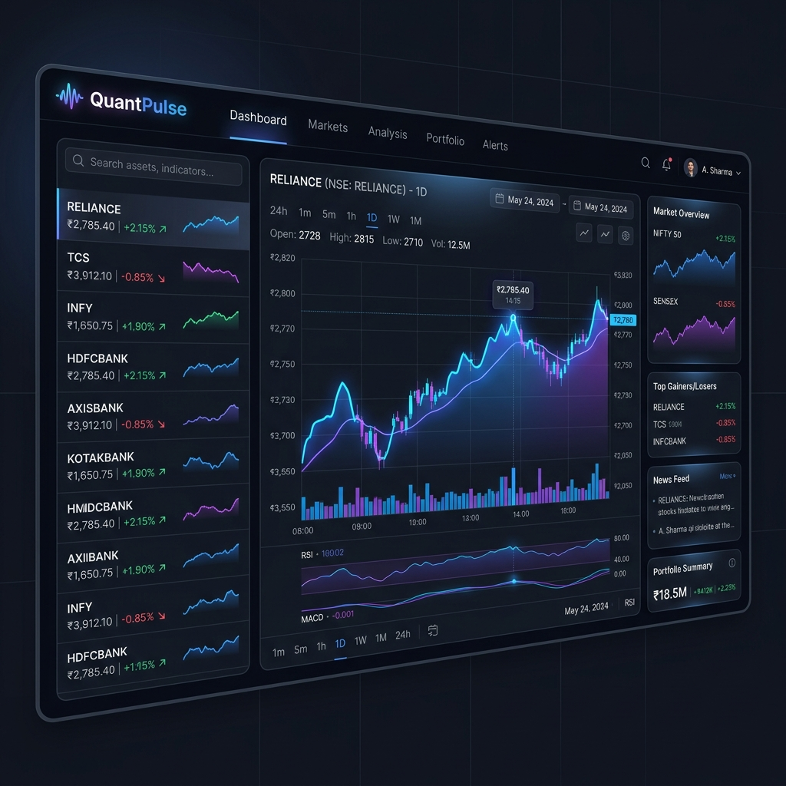

# QuantPulse 📈

QuantPulse is a premium, high-performance NSE (National Stock Exchange) stock market analytics dashboard and API. It provides real-time data visualization, historical performance metrics, and predictive trends using machine learning.




## ✨ Features

-   **Interactive Real-Time Dashboard**: Beautifully designed dark-mode interface with glassmorphism effects.
-   **Predictive Analytics**: Integrated Scikit-learn linear regression models to estimate 7-day price trends.
-   **Deep Metrics**: Automated calculation of 52-week highs/lows, average closing prices, and historical volatility.
-   **Market Movers**: Instant snapshots of top gainers and losers across the tracked symbols.
-   **Modular Data Pipeline**: Robust SQLite-backed pipeline for efficient data storage and retrieval.

## 🛠️ Technology Stack

-   **Frontend**: Vanilla JavaScript, HTML5, CSS3 (Custom Design System), Chart.js
-   **Backend**: Python, FastAPI, SQLAlchemy
-   **Data Science**: Scikit-Learn (Linear Regression), Pandas, NumPy
-   **Database**: SQLite

## 🚀 Getting Started

### Prerequisites

-   Python 3.8+
-   `pip` (Python package manager)

### Installation

1.  **Install dependencies**:
    ```bash
    pip install fastapi uvicorn pandas sqlalchemy scikit-learn yfinance
    ```

2.  **Initialize the data pipeline**:
    Run the data pipeline to fetch historical stock data and populate the database.
    ```bash
    python data_pipeline.py
    ```

3.  **Start the API server**:
    ```bash
    python main.py
    ```

4.  **Open the Dashboard**:
    Simply open `index.html` in your preferred web browser.

## 📁 Project Structure

-   `main.py`: The FastAPI backend serving stock data and predictions.
-   `index.html`: The interactive glassmorphic frontend dashboard.
-   `data_pipeline.py`: Script to fetch and clean NSE market data.
-   `stock_data.db`: Local SQLite database (internal).

---

Developed with ❤️ for high-frequency market analysis.
